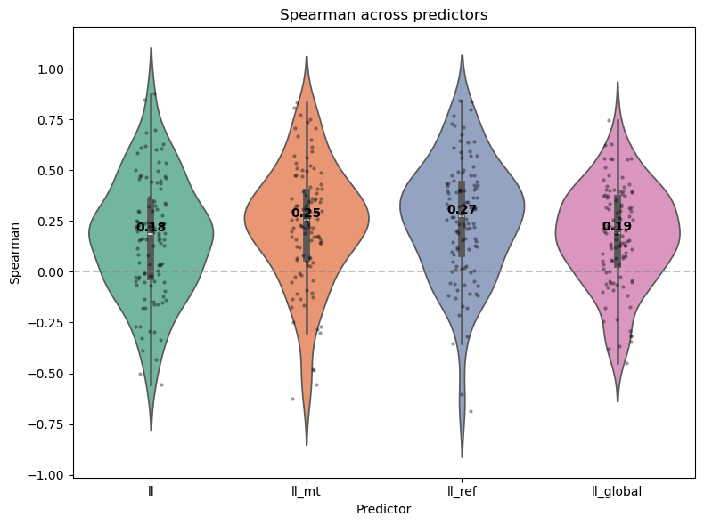
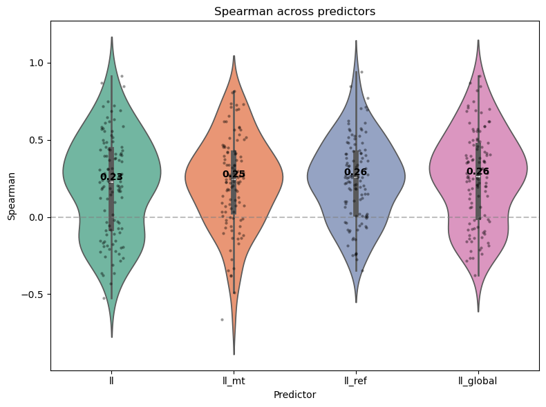
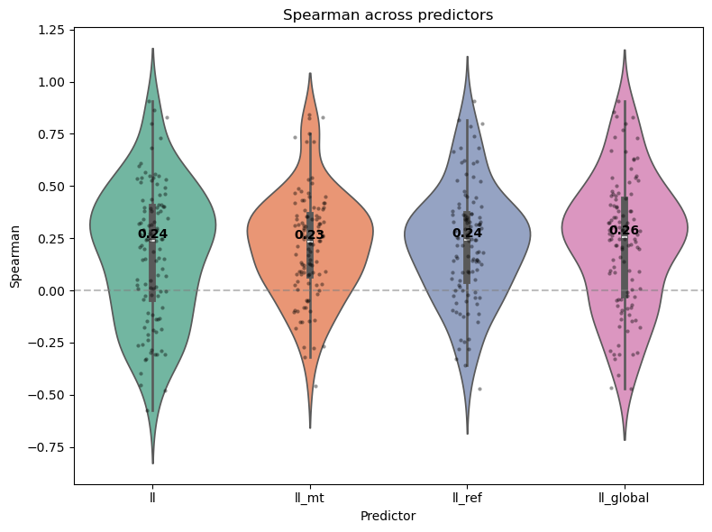
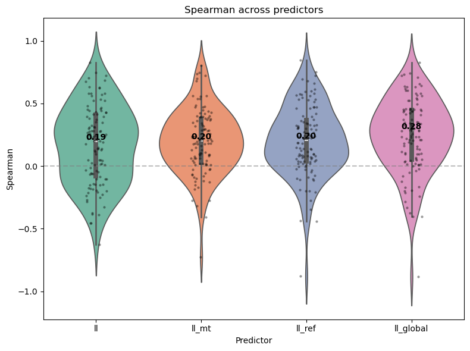
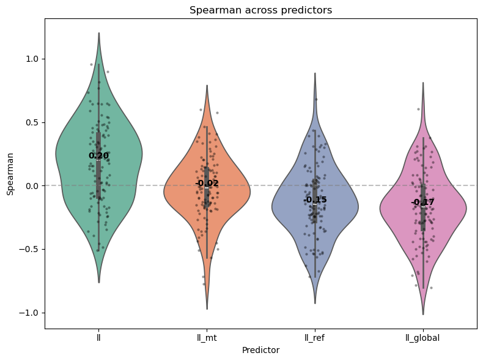
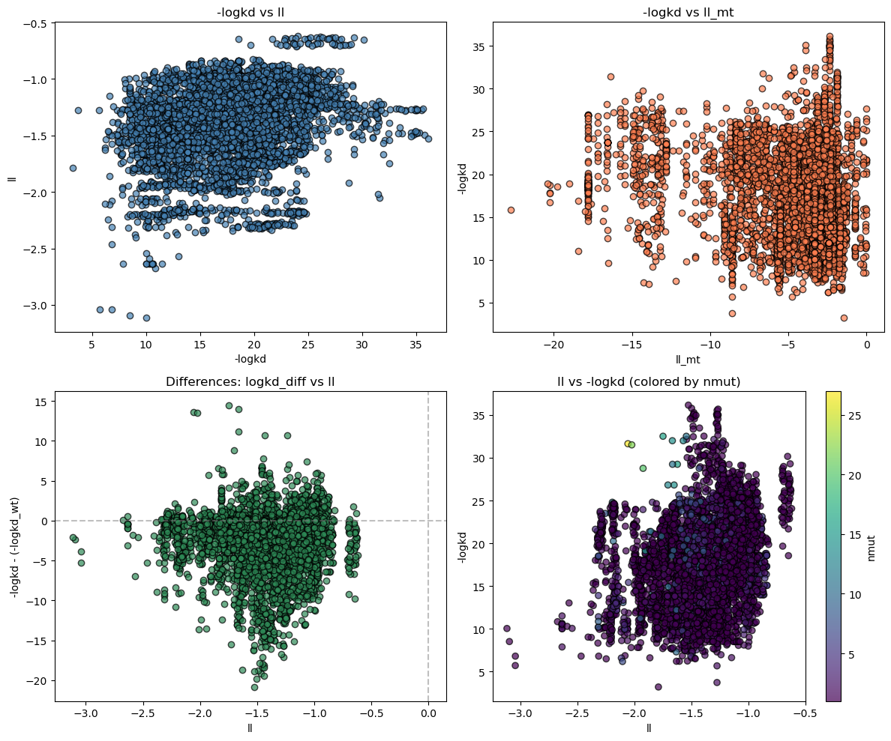

```python
import pandas as pd
import matplotlib.pyplot as plt
import numpy as np
from pathlib import Path
import seaborn as sns
import math

from scipy import stats
from scipy.stats import spearmanr, kendalltau
from sklearn.metrics import ndcg_score

from collections import OrderedDict
from omegaconf import OmegaConf

import torch

from rednet.data import SkempiDataset
from rednet.lightning.base_task import build_task
from rednet.common_utils import move_to_cuda
```

    /home/zwxie/miniconda3/envs/prot/lib/python3.11/site-packages/transformers/utils/generic.py:441: FutureWarning: `torch.utils._pytree._register_pytree_node` is deprecated. Please use `torch.utils._pytree.register_pytree_node` instead.
      _torch_pytree._register_pytree_node(


```python
ckpt_file = Path("/home/zwxie/ckpts/rgat_b64_n002/epoch_028.ckpt")
task = build_task(ckpt_file)
model = task.model
model.cuda()
```


```python
cfg_file = Path("/home/zwxie/codes/rednet/configs/test_exptl/skempiv2.yaml")
cfg = OmegaConf.load(cfg_file)
# cfg = OmegaConf.create({**cfg.data.config})
# print(cfg)
dataset = SkempiDataset(cfg.data.config, use_mut_chain_id=True)
print(len(dataset))
```


```python
dataset[0].keys()
```


    dict_keys(['atom_positions', 'atom_mask', 'chain_index', 'b_factors', 'entity_index', 'chain_id_mapping', 'pdb_res_type', 'design_type', 'res_index', 'res_type', 'mask', 'resolved_mask', 'site_mask', 'res_conf', 'gt_res_type', 'enc_res_type', 'dsn_mask', 'pred_mask', 'file_id', 'index', 'df_index', 'score', 'score_wt'])


```python
(dataset[0]['res_type'] != dataset[0]['pdb_res_type']).sum()
# dataset[0]['design_type']
```


    tensor(1)


```python
def get_df(dataset, file_ids):
      df = []
      for file_id in file_ids:
          start, end = dataset.get_index_range(file_id)

          df.extend([{
            'file_id': dataset[i]['file_id'],
            'score': dataset[i]['score'].item(),
            'score_wt': dataset[i]['score_wt'].item(),
            'delta': dataset[i]['score'].item() - dataset[i]['score_wt'].item(),
          } for i in range(start, end+1)])
      df = pd.DataFrame(df)
      df['file_id'] = df['file_id'].astype(str)

      # Scatter plot
      g = sns.lmplot(data=df, x='score_wt', y='score', hue='file_id', height=6, aspect=1.2,
                     fit_reg=False, legend=False)  # disable default legend
      _min = min(min(df['score_wt']), min(df['score']))
      _max = max(max(df['score_wt']), max(df['score']))
      plt.plot([_min, _max], [_min, _max], 'k--', alpha=0.5)

      # Add compact legend outside plot
      n_cols = max(1, len(df['file_id'].unique()) // 20)
      plt.legend(title='file_id', fontsize=7, title_fontsize=8,
                 ncol=n_cols, loc='center left', bbox_to_anchor=(1.02, 0.5))
      # plt.tight_layout()
      plt.show()

      # Histogram: ratio of rows with delta < 0 per file_id
      ratio_df = df.groupby('file_id')['delta'].agg(
          lambda x: (x < 0).sum() / len(x)
      ).reset_index(name='ratio_negative')
      print(len(list(ratio_df[ratio_df['ratio_negative'] > 0].groupby('file_id'))))

      plt.figure(figsize=(8, max(5, len(ratio_df) * 0.3)))
      sns.barplot(data=ratio_df, y='file_id', x='ratio_negative', orient='h')
      plt.axvline(x=0.5, color='r', linestyle='--', alpha=0.5)
      plt.xlabel('Ratio of delta < 0')
      plt.ylabel('file_id')
      plt.title('Proportion of samples where score < score_wt')
      # plt.xticks(rotation=45, ha='right')
      # plt.tight_layout()
      plt.show()

      return df

def get_data_ids(file_ids):
    data_ids = []
    for file_id in file_ids:
        start, end = dataset.get_index_range(file_id)
        data_ids += list(range(start, end+1))
    return data_ids
```


```python
print(dataset[0]['file_id'], dataset[0]['df_index'], dataset[0]['index'], dataset[0]['score'], dataset[0]['score_wt'])
```

    4B0M 0 0 tensor(-5.3979) tensor(-5.6162)


```python
def get_file_ids(dataset, min_num_variants=1):
    def _get_num(file_id):
        start, end = dataset.get_index_range(file_id)
        return end - start + 1
    return [f for f in dataset.file_ids if _get_num(f) >= min_num_variants]
```


```python
# to draw meaningful spearman rank correlation; we select assays with at least 10 examples
file_ids = get_file_ids(dataset, 10)
print(len(file_ids), len(dataset.file_ids))
```

    126 339


```python
get_df(dataset, file_ids)
```


```python
pmpnn_n002_res_file = Path("/home/zwxie/experiments/skempi_experiments") / "pmpnn_n002" / "results.csv"
assert pmpnn_n002_res_file.exists()
pmpnn_n002_df = pd.read_csv(pmpnn_n002_res_file)
print(pmpnn_n002_df)
```


```python
rgat_n002_res_file = Path("/home/zwxie/experiments/skempi_experiments") / "rgat_b64_n002_e028" / "results.csv"
assert rgat_n002_res_file.exists()
rgat_n002_df = pd.read_csv(rgat_n002_res_file)
```


```python
_res_file = Path("/home/zwxie/experiments/skempi_experiments") / "rgat_b64_n0" / "results.csv"
assert _res_file.exists()
rgat_n0_df = pd.read_csv(_res_file)
```


```python
_res_file = Path("/home/zwxie/experiments/skempi_experiments") / "esmif" / "results.csv"
assert _res_file.exists()
esmif_df = pd.read_csv(_res_file)
```


```python
_res_file = Path("/home/zwxie/experiments/skempi_experiments") / "pifold" / "results.csv"
assert _res_file.exists()
pifold_df = pd.read_csv(_res_file)
```


```python
def plot_dms_df(df):
 # Calculate differences
 df['logkd_diff'] = df['-logkd'] - df['-logkd_wt']

 # Create figure with 2x2 subplots
 fig, axes = plt.subplots(2, 2, figsize=(12, 10))

 # Plot 1: ll vs -logkd_wt
 # axes[0, 0].scatter(df['-logkd_wt'], df['ll'], c='steelblue', alpha=0.7, edgecolors='black')
 # axes[0, 0].set_xlabel('-logkd_wt')
 # axes[0, 0].set_ylabel('ll')
 # axes[0, 0].set_title('ll vs -logkd_wt')
 axes[0, 0].scatter(df['-logkd'], df['ll'], c='steelblue', alpha=0.7, edgecolors='black')
 axes[0, 0].set_xlabel('-logkd')
 axes[0, 0].set_ylabel('ll')
 axes[0, 0].set_title('-logkd vs ll')

 # Plot 2: -logkd vs ll_mt
 axes[0, 1].scatter(df['ll_mt'], df['-logkd'], c='coral', alpha=0.7, edgecolors='black')
 axes[0, 1].set_xlabel('ll_mt')
 axes[0, 1].set_ylabel('-logkd')
 axes[0, 1].set_title('-logkd vs ll_mt')

 # Plot 3: logkd difference vs ll difference
 axes[1, 0].scatter(df['ll'], df['logkd_diff'], c='seagreen', alpha=0.7, edgecolors='black')
 axes[1, 0].set_xlabel('ll')
 axes[1, 0].set_ylabel('-logkd - (-logkd_wt)')
 axes[1, 0].set_title('Differences: logkd_diff vs ll')
 axes[1, 0].axhline(y=0, color='gray', linestyle='--', alpha=0.5)
 axes[1, 0].axvline(x=0, color='gray', linestyle='--', alpha=0.5)

 # Plot 4: score distribution colored by nmut
 scatter = axes[1, 1].scatter(df['ll'], df['-logkd'], c=df['nmut'], cmap='viridis', alpha=0.7, edgecolors='black')
 axes[1, 1].set_xlabel('ll')
 axes[1, 1].set_ylabel('-logkd')
 axes[1, 1].set_title('ll vs -logkd (colored by nmut)')
 plt.colorbar(scatter, ax=axes[1, 1], label='nmut')

 plt.tight_layout()
 plt.show()

def plot_spearman_nmut(df):
  results = []
  for nmut_val in sorted(df['nmut'].unique()):
      subset = df[df['nmut'] == nmut_val]
      if len(subset) >= 2:
          rho, pval = spearmanr(subset['ll_mt'], subset['-logkd'])
          results.append({'nmut': nmut_val, 'spearman_r': rho, 'p_value': pval, 'n': len(subset)})

  results_df = pd.DataFrame(results)

  # Plot
  fig, ax = plt.subplots(figsize=(8, 5))
  bars = ax.bar(results_df['nmut'].astype(str), results_df['spearman_r'], color='steelblue', edgecolor='black')
  ax.axhline(y=0, color='gray', linestyle='--', alpha=0.5)
  ax.set_xlabel('nmut')
  ax.set_ylabel('Spearman r (ll_mt vs -logkd)')
  ax.set_title('Spearman correlation by nmut')

  for bar, n in zip(bars, results_df['n']):
      ax.text(bar.get_x() + bar.get_width()/2, bar.get_height() + 0.02, f'n={n}', ha='center')

  plt.tight_layout()
  plt.show()


def agg_by_file_id(df):
    results = []
    # 'll': design binder
    # 'll_mut': mutated regions
    # 'll_ref': ll - wt_ll of mutated regions
    # 'll_global': complex
    pred_keys = ['ll', 'll_mt', 'll_ref', 'll_global']
    for file_id, subset in df.groupby('file_id'):
        y_true = subset['-logkd'].values - subset['-logkd_wt'].values
        top_k = min(10, len(subset))
        subset_result = {}
        for pred_key in pred_keys:
            y_pred = subset[pred_key].values

            # Spearman
            spearman_r, _ = spearmanr(y_pred, y_true)
            assert not np.isnan(spearman_r), y_pred
            # Kendall's tau
            kendall_tau, _ = kendalltau(y_pred, y_true)

            # NDCG (needs non-negative relevance scores)
            y_true_shifted = y_true - y_true.min() + 1
            ndcg = ndcg_score([y_true_shifted], [y_pred], k=top_k)

            subset_result.update({
                f'{pred_key}-spearman': spearman_r,
                f'{pred_key}-kendall': kendall_tau,
                f'{pred_key}-ndcg': ndcg,
            })
        subset_result.update({'n': len(subset), 'file_id': file_id})
        results.append(subset_result)
    results = pd.DataFrame(results)
    return results
        
def plot_rankings(df):
  results = []
  for nmut_val in [0] + sorted(df['nmut'].unique()):
      subset = df[df['nmut'] == nmut_val] if nmut_val > 0 else df
      if len(subset) >= 10:
          y_true = subset['-logkd'].values - subset['-logkd_wt'].values
          y_pred = subset['ll_mt'].values # - subset['ll'].values

          # Spearman
          spearman_r, _ = spearmanr(y_pred, y_true)

          # Kendall's tau
          kendall_tau, _ = kendalltau(y_pred, y_true)

          # NDCG (needs non-negative relevance scores)
          top_k = min(10, len(subset))
          y_true_shifted = y_true - y_true.min() + 1
          ndcg = ndcg_score([y_true_shifted], [y_pred], k=top_k)

          # Top-k precision (top k overlap)
          top_k_true = set(np.argsort(y_true)[-top_k:])
          top_k_pred = set(np.argsort(y_pred)[-top_k:])
          precision_at_k = len(top_k_true & top_k_pred) / top_k

          results.append({
              'nmut': nmut_val,
              'Spearman': spearman_r,
              'Kendall': kendall_tau,
              'NDCG@K': ndcg,
              'Precision@K': precision_at_k,
              'n': len(subset)
          })

  results_df = pd.DataFrame(results)

  # Plot
  metrics = ['Spearman', 'Kendall', 'NDCG@K', 'Precision@K']
  fig, axes = plt.subplots(2, 2, figsize=(10, 8))
  axes = axes.flatten()

  for ax, metric in zip(axes, metrics):
      bars = ax.bar(results_df['nmut'].astype(str), results_df[metric], color='steelblue', edgecolor='black')
      ax.axhline(y=0, color='gray', linestyle='--', alpha=0.5)
      ax.set_xlabel('nmut')
      ax.set_ylabel(metric)
      ax.set_title(f'{metric} (ll_mt vs -logkd)')
      for bar, n in zip(bars, results_df['n']):
          ax.text(bar.get_x() + bar.get_width()/2, bar.get_height(), f'n={n}', ha='center', va='bottom', fontsize=8)

  print(results_df)
  plt.tight_layout()
  plt.show()
```


```python
def plot_violin(df, pred_key='ll'):
  df_melted = df.melt(
      id_vars=['file_id', 'n'],
      value_vars=[f'{pred_key}-spearman', f'{pred_key}-kendall', f'{pred_key}-ndcg'],
      var_name='Metric',
      value_name='Value'
  )

  fig, ax = plt.subplots(figsize=(8, 6))
  sns.violinplot(data=df_melted, x='Metric', y='Value', palette='Set2', ax=ax)
  sns.stripplot(data=df_melted, x='Metric', y='Value', color='black', alpha=0.4, size=3, ax=ax)

  ax.axhline(y=0, color='gray', linestyle='--', alpha=0.5)
  ax.set_ylabel('Score')
  ax.set_title('Distribution of Ranking Metrics')

  # Add median labels
  medians = df[['Spearman', 'Kendall', 'NDCG@K']].median()
  for i, metric in enumerate(['Spearman', 'Kendall', 'NDCG@K']):
      ax.text(i, medians[metric], f'{medians[metric]:.2f}', ha='center', va='bottom', fontweight='bold')

  plt.tight_layout()
  plt.show()

def plot_violin_overlay(df, pred_keys=['ll', 'll_mt', 'll_ref', 'll_global'], metric='spearman'):
      valid_keys = [k for k in pred_keys if not df[f'{k}-{metric}'].isna().all()]

      data = pd.DataFrame({k: df[f'{k}-{metric}'].dropna() for k in valid_keys})
      df_melted = data.melt(var_name='Predictor', value_name=metric.capitalize())

      fig, ax = plt.subplots(figsize=(8, 6))
      sns.violinplot(data=df_melted, x='Predictor', y=metric.capitalize(), palette='Set2', ax=ax)
      sns.stripplot(data=df_melted, x='Predictor', y=metric.capitalize(), color='black', alpha=0.4, size=3, ax=ax)

      ax.axhline(y=0, color='gray', linestyle='--', alpha=0.5)
      ax.set_title(f'{metric.capitalize()} across predictors')

      for i, k in enumerate(valid_keys):
          med = df[f'{k}-{metric}'].median()
          ax.text(i, med, f'{med:.2f}', ha='center', va='bottom', fontweight='bold')

      plt.tight_layout()
      plt.show()
```


```python
pmpnn_n002_df_g = agg_by_file_id(pmpnn_n002_df)
print(pmpnn_n002_df_g.iloc[0])
print(pmpnn_n002_df_g.describe())
# plot_violin(pmpnn_n002_df_g)
plot_violin_overlay(pmpnn_n002_df_g)
```

    ll-spearman           0.228054
    ll-kendall            0.152473
    ll-ndcg               0.866509
    ll_mt-spearman        0.157166
    ll_mt-kendall         0.112031
    ll_mt-ndcg            0.854081
    ll_ref-spearman       0.344394
    ll_ref-kendall        0.229268
    ll_ref-ndcg            0.84828
    ll_global-spearman    0.141192
    ll_global-kendall     0.094908
    ll_global-ndcg         0.85272
    n                          251
    file_id                   1A22
    Name: 0, dtype: object
           ll-spearman  ll-kendall     ll-ndcg  ll_mt-spearman  ll_mt-kendall  \
    count   110.000000  110.000000  110.000000      110.000000     110.000000   
    mean      0.164711    0.120207    0.779527        0.230820       0.166501   
    std       0.288162    0.209030    0.122998        0.288970       0.210313   
    min      -0.553270   -0.405840    0.392910       -0.625710      -0.459019   
    25%      -0.024261   -0.013955    0.709384        0.068858       0.052212   
    50%       0.184149    0.119253    0.794949        0.254349       0.171879   
    75%       0.338246    0.252165    0.872075        0.392851       0.284348   
    max       0.878788    0.733333    0.990307        0.835187       0.681189   
    
           ll_mt-ndcg  ll_ref-spearman  ll_ref-kendall  ll_ref-ndcg  \
    count  110.000000       110.000000      110.000000   110.000000   
    mean     0.797788         0.258409        0.184244     0.803722   
    std      0.120232         0.287196        0.218632     0.118130   
    min      0.488622        -0.687661       -0.524593     0.489854   
    25%      0.714838         0.088618        0.039382     0.740140   
    50%      0.815537         0.272670        0.203737     0.817887   
    75%      0.886537         0.431569        0.309566     0.896257   
    max      0.989879         0.842424        0.709091     0.983787   
    
           ll_global-spearman  ll_global-kendall  ll_global-ndcg           n  
    count          110.000000         110.000000      110.000000  110.000000  
    mean             0.173726           0.123054        0.778689   51.863636  
    std              0.243206           0.176794        0.123086   67.183096  
    min             -0.447489          -0.325221        0.454568   10.000000  
    25%              0.034957           0.012184        0.698417   17.000000  
    50%              0.191213           0.132896        0.787962   27.000000  
    75%              0.361793           0.256887        0.872108   46.000000  
    max              0.745455           0.636364        0.978708  295.000000  


    /tmp/ipykernel_1094938/1294927803.py:32: FutureWarning: 
    
    Passing `palette` without assigning `hue` is deprecated and will be removed in v0.14.0. Assign the `x` variable to `hue` and set `legend=False` for the same effect.
    
      sns.violinplot(data=df_melted, x='Predictor', y=metric.capitalize(), palette='Set2', ax=ax)


    

    


```python
rgat_n002_df_g = agg_by_file_id(rgat_n002_df)
print(rgat_n002_df_g.describe())
plot_violin_overlay(rgat_n002_df_g)
```

           ll-spearman  ll-kendall     ll-ndcg  ll_mt-spearman  ll_mt-kendall  \
    count   110.000000  110.000000  110.000000      110.000000     110.000000   
    mean      0.207055    0.153667    0.790955        0.224126       0.162034   
    std       0.323496    0.237204    0.129419        0.292013       0.214923   
    min      -0.524691   -0.361235    0.323516       -0.661765      -0.500000   
    25%      -0.072896   -0.043595    0.714933        0.034176       0.035597   
    50%       0.228180    0.162304    0.803573        0.245480       0.166782   
    75%       0.436391    0.304034    0.895090        0.415469       0.312603   
    max       0.915152    0.733333    0.988185        0.818182       0.644444   
    
           ll_mt-ndcg  ll_ref-spearman  ll_ref-kendall  ll_ref-ndcg  \
    count  110.000000       110.000000      110.000000   110.000000   
    mean     0.812289         0.241064        0.174509     0.809033   
    std      0.113414         0.263511        0.197420     0.117970   
    min      0.437428        -0.346154       -0.230769     0.425416   
    25%      0.754707         0.021603        0.022088     0.741275   
    50%      0.826213         0.256232        0.171871     0.828670   
    75%      0.889296         0.414305        0.306103     0.896108   
    max      0.987448         0.939394        0.822222     0.995629   
    
           ll_global-spearman  ll_global-kendall  ll_global-ndcg           n  
    count          110.000000         110.000000      110.000000  110.000000  
    mean             0.257520           0.187691        0.802874   51.863636  
    std              0.298233           0.223634        0.119332   67.183096  
    min             -0.379121          -0.256410        0.437927   10.000000  
    25%             -0.001796           0.023875        0.741009   17.000000  
    50%              0.262163           0.189708        0.813318   27.000000  
    75%              0.464157           0.338354        0.894870   46.000000  
    max              0.915152           0.733333        0.988185  295.000000  


    /tmp/ipykernel_1094938/1294927803.py:32: FutureWarning: 
    
    Passing `palette` without assigning `hue` is deprecated and will be removed in v0.14.0. Assign the `x` variable to `hue` and set `legend=False` for the same effect.
    
      sns.violinplot(data=df_melted, x='Predictor', y=metric.capitalize(), palette='Set2', ax=ax)


    

    


```python
rgat_n0_df_g = agg_by_file_id(rgat_n0_df)
print(rgat_n0_df_g.describe())
plot_violin_overlay(rgat_n0_df_g)
```

           ll-spearman  ll-kendall     ll-ndcg  ll_mt-spearman  ll_mt-kendall  \
    count   110.000000  110.000000  110.000000      110.000000     110.000000   
    mean      0.179256    0.131686    0.785621        0.213979       0.151487   
    std       0.321966    0.237470    0.123289        0.253329       0.192042   
    min      -0.575567   -0.442039    0.323516       -0.459446      -0.345455   
    25%      -0.037640   -0.047917    0.712854        0.074226       0.044737   
    50%       0.239249    0.164148    0.799067        0.231538       0.145730   
    75%       0.399448    0.291823    0.880430        0.356853       0.245456   
    max       0.909091    0.781818    0.992439        0.844291       0.709091   
    
           ll_mt-ndcg  ll_ref-spearman  ll_ref-kendall  ll_ref-ndcg  \
    count  110.000000       110.000000      110.000000   110.000000   
    mean     0.801119         0.222116        0.162279     0.796390   
    std      0.112627         0.272608        0.202310     0.121518   
    min      0.464077        -0.472527       -0.333333     0.442803   
    25%      0.734936         0.047993        0.036745     0.725786   
    50%      0.815221         0.243358        0.171046     0.805240   
    75%      0.893140         0.363887        0.259258     0.886031   
    max      0.983820         0.909091        0.781818     0.992439   
    
           ll_global-spearman  ll_global-kendall  ll_global-ndcg           n  
    count          110.000000         110.000000      110.000000  110.000000  
    mean             0.228063           0.168279        0.800300   51.863636  
    std              0.312569           0.233137        0.118276   67.183096  
    min             -0.470588          -0.333333        0.446202   10.000000  
    25%             -0.021482          -0.013782        0.734385   17.000000  
    50%              0.256272           0.176132        0.822390   27.000000  
    75%              0.431177           0.311993        0.883812   46.000000  
    max              0.909091           0.781818        0.992439  295.000000  


    /tmp/ipykernel_1094938/1294927803.py:32: FutureWarning: 
    
    Passing `palette` without assigning `hue` is deprecated and will be removed in v0.14.0. Assign the `x` variable to `hue` and set `legend=False` for the same effect.
    
      sns.violinplot(data=df_melted, x='Predictor', y=metric.capitalize(), palette='Set2', ax=ax)


    

    


```python
esmif_df_g = agg_by_file_id(esmif_df)
print(esmif_df_g.describe())
plot_violin_overlay(esmif_df_g)
```

           ll-spearman  ll-kendall     ll-ndcg  ll_mt-spearman  ll_mt-kendall  \
    count   110.000000  110.000000  110.000000      110.000000     110.000000   
    mean      0.162143    0.116931    0.773605        0.197220       0.137251   
    std       0.314192    0.226948    0.134845        0.257014       0.184543   
    min      -0.628137   -0.436914    0.346087       -0.725275      -0.564103   
    25%      -0.080317   -0.058510    0.696940        0.031606       0.024555   
    50%       0.194429    0.136628    0.795024        0.201491       0.134436   
    75%       0.408560    0.272838    0.866177        0.376055       0.251606   
    max       0.827273    0.672727    0.990647        0.802808       0.606838   
    
           ll_mt-ndcg  ll_ref-spearman  ll_ref-kendall  ll_ref-ndcg  \
    count  110.000000       110.000000      110.000000   110.000000   
    mean     0.791099         0.203129        0.142540     0.780153   
    std      0.122932         0.282043        0.208596     0.141027   
    min      0.459211        -0.879121       -0.717949     0.378100   
    25%      0.717044         0.037299        0.026226     0.694700   
    50%      0.793441         0.203803        0.127094     0.805643   
    75%      0.899908         0.368232        0.269253     0.892715   
    max      0.986217         0.845455        0.672727     0.986217   
    
           ll_global-spearman  ll_global-kendall  ll_global-ndcg           n  
    count          110.000000         110.000000      110.000000  110.000000  
    mean             0.242478           0.174925        0.786266   51.863636  
    std              0.294613           0.217401        0.142384   67.183096  
    min             -0.883082          -0.683885        0.315548   10.000000  
    25%              0.054944           0.040721        0.705755   17.000000  
    50%              0.279902           0.192503        0.817423   27.000000  
    75%              0.449573           0.318606        0.900105   46.000000  
    max              0.827273           0.672727        0.990647  295.000000  


    /tmp/ipykernel_1094938/1294927803.py:32: FutureWarning: 
    
    Passing `palette` without assigning `hue` is deprecated and will be removed in v0.14.0. Assign the `x` variable to `hue` and set `legend=False` for the same effect.
    
      sns.violinplot(data=df_melted, x='Predictor', y=metric.capitalize(), palette='Set2', ax=ax)


    

    


```python
pifold_df_g = agg_by_file_id(pifold_df)
print(pifold_df_g.describe())
plot_violin_overlay(pifold_df_g)
```

           ll-spearman  ll-kendall     ll-ndcg  ll_mt-spearman  ll_mt-kendall  \
    count   110.000000  110.000000  110.000000      110.000000     110.000000   
    mean      0.173686    0.131715    0.783716       -0.025537      -0.015535   
    std       0.320458    0.235286    0.131212        0.249910       0.181750   
    min      -0.512130   -0.352941    0.401076       -0.776645      -0.613765   
    25%      -0.084179   -0.051907    0.713715       -0.153512      -0.106884   
    50%       0.198768    0.125950    0.802775       -0.018910      -0.017615   
    75%       0.399024    0.268795    0.883305        0.125675       0.095564   
    max       0.954545    0.854545    0.993387        0.596940       0.486453   
    
           ll_mt-ndcg  ll_ref-spearman  ll_ref-kendall  ll_ref-ndcg  \
    count  110.000000       110.000000      110.000000   110.000000   
    mean     0.715766        -0.123691       -0.089915     0.693694   
    std      0.133593         0.266121        0.190542     0.139162   
    min      0.390948        -0.718943       -0.511111     0.313250   
    25%      0.626856        -0.276421       -0.190607     0.591572   
    50%      0.734663        -0.147629       -0.110195     0.703634   
    75%      0.816478         0.035300        0.027561     0.792281   
    max      0.971611         0.680434        0.511478     0.974750   
    
           ll_global-spearman  ll_global-kendall  ll_global-ndcg           n  
    count          110.000000         110.000000      110.000000  110.000000  
    mean            -0.170426          -0.127519        0.666037   51.863636  
    std              0.269569           0.199473        0.150063   67.183096  
    min             -0.803302          -0.683885        0.279015   10.000000  
    25%             -0.340900          -0.244382        0.542421   17.000000  
    50%             -0.168708          -0.133318        0.684049   27.000000  
    75%             -0.003644           0.017015        0.766844   46.000000  
    max              0.602994           0.445904        0.953231  295.000000  


    /tmp/ipykernel_1094938/1294927803.py:32: FutureWarning: 
    
    Passing `palette` without assigning `hue` is deprecated and will be removed in v0.14.0. Assign the `x` variable to `hue` and set `legend=False` for the same effect.
    
      sns.violinplot(data=df_melted, x='Predictor', y=metric.capitalize(), palette='Set2', ax=ax)


    

    


```python
plot_dms_df(pifold_df)
```


    

    


```python

```
